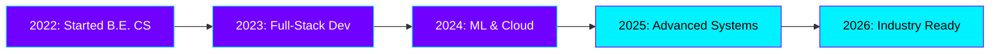

<div align="center">

<!-- Animated Header with Glitch Effect -->


<!-- Animated Badges -->
<p align="center">
  
  
  
</p>

<!-- Social Links with Hover Animation -->
<p align="center">
  <a href="https://linkedin.com/in/shubham-mali-498362352" target="_blank">
    
  </a>
  <a href="https://shubhamx18.github.io/" target="_blank">
    
  </a>
  <a href="https://leetcode.com/u/wfjvxy4pch/" target="_blank">
    
  </a>
  <a href="mailto:shubhamx2004s@gmail.com">
    
  </a>
  <a href="https://github.com/shubhamx18" target="_blank">
    
  </a>
</p>

</div>

<!-- Animated Divider -->


<div align="center">

##  ABOUT ME 

</div>

```typescript
const shubham = {
    pronouns: "He" | "Him",
    location: "India 🇮🇳",
    education: {
        degree: "B.E. Computer Science",
        timeline: "2022 - 2026",
        focus: "Applied Machine Learning & Cloud Systems"
    },
    currentFocus: [
        "Building High-Performance Software Systems",
        "Machine Learning & Data Intelligence",
        "Cloud-Native Architecture & DevOps",
        "Open Source Contributions"
    ],
    techStack: {
        languages: ["Python", "Java", "C++", "C", "JavaScript", "PHP"],
        frontend: ["HTML5", "CSS3", "JavaScript"],
        backend: ["PHP", "MySQL"],
        ml_data: ["NumPy", "Pandas", "SciPy", "Power BI"],
        cloud_devops: ["Docker", "AWS", "Linux", "Git", "CI/CD"],
        tools: ["VSCode", "Postman", "GitHub"]
    },
    currentlyLearning: "Advanced ML Pipelines & Microservices",
    funFact: "I debug with console.log() and I'm not ashamed! 🚀"
};
```

<!-- Animated Divider -->


<div align="center">

##  TECH ARSENAL 

</div>

### 🎯 Core Languages
<p align="center">
  
</p>

### 🎨 Frontend Development
<p align="center">
  
</p>

### 🗄️ Backend & Database
<p align="center">
  
</p>

### ☁️ Cloud & DevOps
<p align="center">
  
</p>

### 🛠️ Tools & Environment
<p align="center">
  
</p>

### 🧠 Data Science & ML
<p align="center">
  
  
  
  
</p>

<!-- Animated Divider -->


<div align="center">

## 📊 GITHUB STATISTICS


</div>

<!-- Animated Divider -->


<div align="center">

## 🏆 GITHUB TROPHIES


</div>

<!-- Animated Divider -->


<div align="center">

## 📈 CONTRIBUTION GRAPH


</div>

<!-- Animated Divider -->


<div align="center">

## 🐍 CONTRIBUTION SNAKE

<picture>
  <source media="(prefers-color-scheme: dark)" srcset="https://raw.githubusercontent.com/shubhamx18/shubhamx18/output/github-contribution-grid-snake-dark.svg">
  <source media="(prefers-color-scheme: light)" srcset="https://raw.githubusercontent.com/shubhamx18/shubhamx18/output/github-contribution-grid-snake.svg">
  
</picture>

</div>

<!-- Animated Divider -->


<div align="center">

## 💡 RANDOM DEV QUOTE


</div>

<!-- Animated Divider -->


<div align="center">

## 🎵 SPOTIFY PLAYING

[](https://open.spotify.com/user/31l5bfo7wb3osgrd4pqzne7mhfge)

</div>

<!-- Animated Divider -->


<div align="center">

## 💼 EXPERIENCE ROADMAP



</div>

<!-- Animated Divider -->


<div align="center">

## 🎯 CURRENT OBJECTIVES

<table>
  <tr>
    <td align="center" width="33%">
      
      <br><b>Building Scalable Apps</b>
      <br>Microservices & Cloud Architecture
    </td>
    <td align="center" width="33%">
      
      <br><b>ML Pipelines</b>
      <br>Data Intelligence & Analytics
    </td>
    <td align="center" width="33%">
      
      <br><b>Open Source</b>
      <br>Contributing to Community
    </td>
  </tr>
</table>

</div>

<!-- Animated Divider -->


<div align="center">

## 🤝 LET'S CONNECT

<p>
  <i>💬 Feel free to reach out for collaborations or just a friendly chat!</i>
  <br><br>
  <a href="https://linkedin.com/in/shubham-mali-498362352" target="_blank">
    
  </a>
  <a href="mailto:shubhamx2004s@gmail.com">
    
  </a>
  <a href="https://shubhamx18.github.io/" target="_blank">
    
  </a>
</p>

<p>
  
</p>

<p>
  
</p>

</div>

---

<div align="center">
  <sub>Built with 💜 by Shubham Mali</sub>
  <br>
  <sub>⚡ Powered by Code, Coffee & Curiosity ⚡</sub>
</div>
