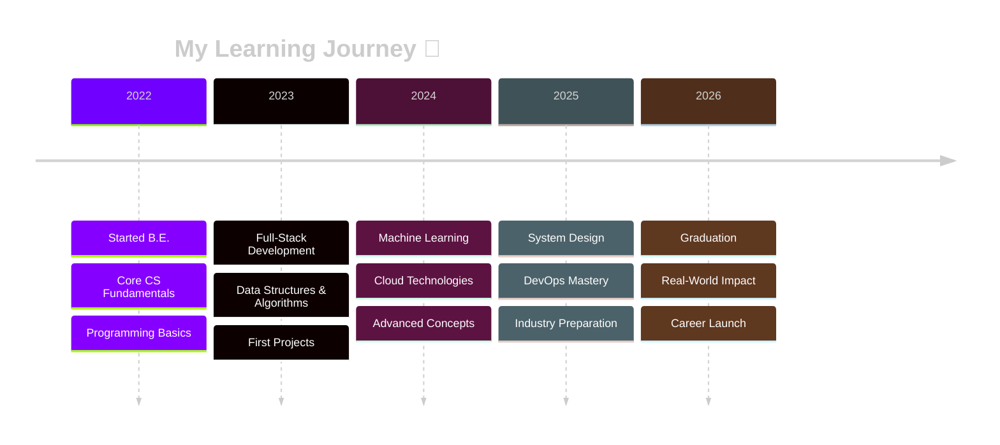

<div align="center">

<!-- Epic Animated Header -->


<!-- Dynamic Title with Glitch Effect -->
<h1>
  
</h1>

<!-- Animated Subtitle -->
<p>
  
</p>

<!-- Animated Divider -->


<!-- Enhanced Badges -->
<p>
  
  
  
  
</p>

<!-- Social Links -->
<p>
  <a href="https://linkedin.com/in/shubham-mali-498362352">
    
  </a>
  <a href="https://shubhamx18.github.io/">
    
  </a>
  <a href="https://leetcode.com/u/wfjvxy4pch/">
    
  </a>
  <a href="mailto:shubhamx2004s@gmail.com">
    
  </a>
  <a href="https://github.com/shubhamx18">
    
  </a>
</p>

</div>

<!-- Glowing Divider -->


<!-- About Me Section -->
<details open>
<summary><h2> ABOUT ME</h2></summary>

<br>

```typescript
const shubhamMali = {
    location: "India 🇮🇳",
    role: "Computer Science Engineering Student",
    passions: ["Full-Stack Development", "Machine Learning", "Cloud Technologies"],
    
    education: {
        degree: "B.E. in Computer Science",
        timeline: "2022 - 2026",
        focusAreas: [
            "Applied Machine Learning",
            "Cloud & DevOps", 
            "Full-Stack Web Development"
        ]
    },
    
    mindset: {
        approach: "Building scalable, real-world applications",
        interest: "Understanding how modern systems work end-to-end",
        philosophy: "Clean code + Efficient solutions + Data-driven decisions"
    },
    
    currentFocus: [
        "📚 Mastering Full-Stack Development",
        "🤖 Exploring Machine Learning Applications",
        "☁️ Learning Cloud Architecture & DevOps",
        "🧩 Solving Complex Problems",
        "🌐 Building Real-World Projects"
    ],
    
    lifeGoals: {
        shortTerm: "Master system design & build impactful applications",
        longTerm: "Contribute to innovative tech solutions globally"
    },
    
    funFact: "I believe every bug is just an opportunity to learn something new! 🐛➡️💡"
};

console.log(shubhamMali.mindset.philosophy);
// Output: "Clean code + Efficient solutions + Data-driven decisions"
```

<div align="center">

### 🎯 What Drives Me

> *I focus on writing **clean, efficient code**, understanding **system design**, and applying **data-driven approaches** to solve real problems.*

<table>
  <tr>
    <td align="center" width="33%">
      
      <br><b>Problem Solver</b>
      <br><sub>Clean & efficient solutions</sub>
    </td>
    <td align="center" width="33%">
      
      <br><b>System Thinker</b>
      <br><sub>End-to-end understanding</sub>
    </td>
    <td align="center" width="33%">
      
      <br><b>Continuous Learner</b>
      <br><sub>Always exploring & growing</sub>
    </td>
  </tr>
</table>

</div>

</details>

<!-- Glowing Divider -->


<!-- Education Section -->
<details open>
<summary><h2>🎓 EDUCATION</h2></summary>

<br>

<div align="center">

### 🏛️ Bachelor of Engineering in Computer Science

<table>
  <tr>
    <td align="center" width="50%">
      
      <br><br>
      
    </td>
    <td align="left" width="50%">
      <b>🎯 Focus Areas:</b><br><br>
      • Applied Machine Learning<br>
      • Cloud & DevOps<br>
      • Full-Stack Web Development<br>
      • System Design & Architecture<br>
      • Data Analysis & Visualization
    </td>
  </tr>
</table>



</div>

</details>

<!-- Glowing Divider -->


<!-- Technical Skills Section -->
<details open>
<summary><h2> TECHNICAL SKILLS</h2></summary>

<br>

### 💻 Programming Languages

<div align="center">


<br>


</div>

---

### 🌐 Web Development

<div align="center">

<table>
  <tr>
    <td align="center" width="50%">
      <b>Frontend</b><br><br>
      <br><br>
      
      
      
    </td>
    <td align="center" width="50%">
      <b>Backend & Database</b><br><br>
      <br><br>
      
      
    </td>
  </tr>
</table>

</div>

---

### 📊 Data & Machine Learning

<div align="center">

<table>
  <tr>
    <td align="center" width="25%">
      <br>
      <b>NumPy</b><br>
      <sub>Numerical Computing</sub>
    </td>
    <td align="center" width="25%">
      <br>
      <b>Pandas</b><br>
      <sub>Data Manipulation</sub>
    </td>
    <td align="center" width="25%">
      <br>
      <b>SciPy</b><br>
      <sub>Scientific Computing</sub>
    </td>
    <td align="center" width="25%">
      <br>
      <b>Power BI</b><br>
      <sub>Data Visualization</sub>
    </td>
  </tr>
</table>

<br>


</div>

---

### ☁️ Cloud & DevOps

<div align="center">


<br><br>

<table>
  <tr>
    <td align="center" width="20%">
      <br>
      <b>Docker</b>
    </td>
    <td align="center" width="20%">
      <br>
      <b>AWS</b>
    </td>
    <td align="center" width="20%">
      <br>
      <b>Linux</b>
    </td>
    <td align="center" width="20%">
      <br>
      <b>Git</b>
    </td>
    <td align="center" width="20%">
      <br>
      <b>GitHub</b>
    </td>
  </tr>
</table>

<br>


</div>

---

### 🛠️ Tools & Environment

<div align="center">


<br><br>


</div>

</details>

<!-- Glowing Divider -->


<!-- GitHub Stats Section -->
<details open>
<summary><h2>📊 GITHUB STATISTICS</h2></summary>

<br>

<div align="center">

<!-- Main Stats -->


<!-- Language Stats -->


<!-- Contribution Graph -->


<!-- Profile Summary -->


</div>

</details>

<!-- Glowing Divider -->


<!-- Achievements -->
<details open>
<summary><h2>🏆 GITHUB TROPHIES</h2></summary>

<br>

<div align="center">


</div>

</details>

<!-- Glowing Divider -->


<!-- Snake Animation -->
<details open>
<summary><h2>🐍 CONTRIBUTION SNAKE</h2></summary>

<br>

<div align="center">

<picture>
  <source media="(prefers-color-scheme: dark)" srcset="https://raw.githubusercontent.com/shubhamx18/shubhamx18/output/github-contribution-grid-snake-dark.svg">
  <source media="(prefers-color-scheme: light)" srcset="https://raw.githubusercontent.com/shubhamx18/shubhamx18/output/github-contribution-grid-snake.svg">
  
</picture>

</div>

</details>

<!-- Glowing Divider -->


<!-- Current Focus -->
<details open>
<summary><h2>🎯 CURRENT FOCUS</h2></summary>

<br>

<div align="center">

```python
current_goals = {
    "📚 Learning": [
        "Advanced System Design Patterns",
        "Machine Learning Algorithms",
        "Cloud Architecture on AWS",
        "Microservices & Docker/Kubernetes"
    ],
    
    "💻 Building": [
        "Full-Stack Web Applications",
        "ML-Powered Projects",
        "Clean & Scalable Solutions",
        "Real-World Problem Solvers"
    ],
    
    "🌱 Growing": [
        "Open Source Contributions",
        "Technical Writing & Documentation",
        "Community Engagement",
        "Professional Networking"
    ],
    
    "🎓 Preparing For": [
        "Industry-Ready Skills",
        "Internship Opportunities",
        "Technical Interviews",
        "Real-World Impact"
    ]
}

for category, goals in current_goals.items():
    print(f"\n{category}")
    for goal in goals:
        print(f"  ✓ {goal}")
```

<br>

### 🚀 2025 Roadmap

<table>
  <tr>
    <td align="center" width="25%">
      <br>
      <b>Q1 2025</b><br>
      <sub>System Design Mastery</sub><br>
      <sub>DSA Practice</sub>
    </td>
    <td align="center" width="25%">
      <br>
      <b>Q2 2025</b><br>
      <sub>Cloud Certifications</sub><br>
      <sub>ML Projects</sub>
    </td>
    <td align="center" width="25%">
      <br>
      <b>Q3 2025</b><br>
      <sub>Open Source Contribution</sub><br>
      <sub>Portfolio Building</sub>
    </td>
    <td align="center" width="25%">
      <br>
      <b>Q4 2025</b><br>
      <sub>Internship Hunt</sub><br>
      <sub>Interview Prep</sub>
    </td>
  </tr>
</table>

</div>

</details>

<!-- Glowing Divider -->


<!-- Connect Section -->
<details open>
<summary><h2>🤝 LET'S CONNECT</h2></summary>

<br>

<div align="center">


<br><br>

### 📬 Reach Out

<p>
  <a href="https://linkedin.com/in/shubham-mali-498362352">
    
  </a>
  <a href="mailto:shubhamx2004s@gmail.com">
    
  </a>
  <a href="https://shubhamx18.github.io/">
    
  </a>
  <a href="https://leetcode.com/u/wfjvxy4pch/">
    
  </a>
</p>

<br>

### 💡 What I'm Looking For

<table>
  <tr>
    <td align="center" width="33%">
      🤝<br>
      <b>Collaboration</b><br>
      <sub>Open source projects<br>& team building</sub>
    </td>
    <td align="center" width="33%">
      💼<br>
      <b>Opportunities</b><br>
      <sub>Internships & learning<br>experiences</sub>
    </td>
    <td align="center" width="33%">
      🌱<br>
      <b>Mentorship</b><br>
      <sub>Guidance from<br>experienced developers</sub>
    </td>
  </tr>
</table>

<br>

### ⚡ Quick Facts

```javascript
const quickFacts = {
    🌍: "Based in India, thinking globally",
    💻: "Code is my canvas, logic is my art",
    📚: "Forever a student, always learning",
    ☕: "Powered by coffee and curiosity",
    🎯: "Goal: Make an impact through technology",
    🌟: "Believer in clean code & best practices"
};
```

</div>

</details>

<!-- Glowing Divider -->


<!-- Footer -->
<div align="center">


<br>


<br>

<p>
  
  
</p>

<br>

<!-- Visitor Counter -->


<br><br>

<!-- Inspiring Quote -->


<br><br>

---

<sub>✨ <i>"First, solve the problem. Then, write the code."</i> - John Johnson</sub>

<br>


</div>
